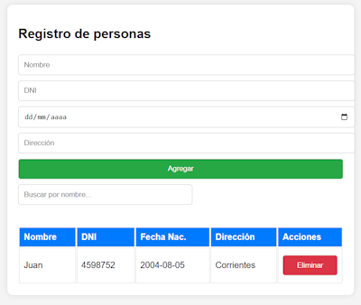

# DESWEB-3CapasIndependientes
 
Se usó la *capa de presentación* _(presentación.html)_ desarrollada en clase, solo se cambió 'CRUD Personas' por 'Registro de personas'.

Se desarrolló una API REST _(negocio.js)_ como *capa de negocio*. Esta API REST se elaboró con Node.js, Express, BetterSQLite3.

_Si bien estaríamos usando la capa de negocio para generar *personas.db*_, este archivo puede ser reemplazado por uno igual, por lo que podríamos considerar que esta *capa de datos* sería "independiente".

